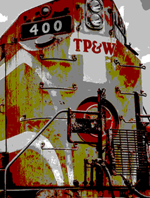

#
数字图像处理Matlab作业

齐冀

08111101

1120112111

## 作业组成
### 一. 源代码
1. 第八章 图像变换
	- 傅里叶变换 FourierTransform.m
	- 离散余弦变换 DCT.m
	- 小波变换 wavelet.m
 
 
2. 第十章 图像复原
	- 盲去卷积复原 BlindDeconvolution.m
	- 维纳滤波 WienerFilter.m
 
 
3. 第十二章 图像分割
	- canny算子边缘检测 canny.m
	- marr算子边缘检测 Marr.m
 
 
4. 第十四章 编码
	- 区域压缩编码 fieldpress.m
	- 阈值编码压缩 yuzhipress.m
 
 
5. 其它 直方图均衡化  
	- junhenghua.m
	
### 二. 程序运行截图
### 三. 测试用图片  
